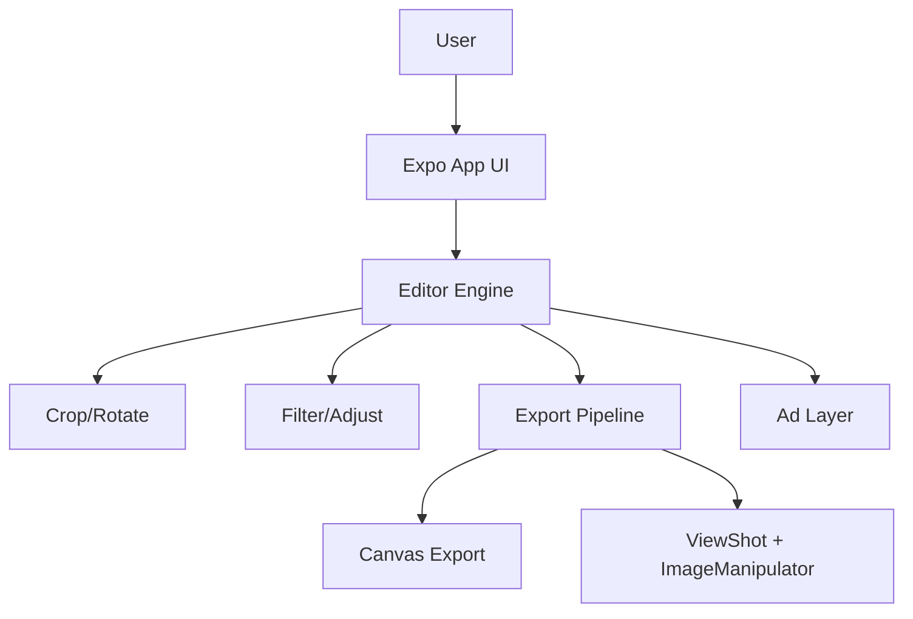

# Hi, I'm HAN DAE HYEON 👋

**풀스택 개발자** | 실무 서비스 고도화와 사이드 프로젝트 운영을 병행하며, 빠르게 만들고 안정적으로 유지하는 제품 개발을 지향합니다.

[](mailto:choco5958@naver.com)
[](https://github.com/choco5958/image-crop-app)

---

<div align="center">

### 📈 By the Numbers

| 📦 Repos | 🚀 Production Projects | 🧩 Private Repos | 🔄 Updated (6M) | 🌐 Live Services |
| :------: | :--------------------: | :--------------: | :-------------: | :--------------: |
| **28** | **4** | **14** | **10** | **3** |

</div>

---

## 🚀 Production Projects

### [CropLab (image-crop-app)](https://github.com/choco5958/image-crop-app) - 이미지 크롭/보정 앱

> **Expo + React Native + TypeScript · 광고 연동 · 저장 파이프라인 최적화**

- ✂️ **Features**: 자유/고정 비율 크롭, 회전, 필터/보정, 저장 품질 선택
- 📱 **Platform**: Web + Native 저장 분기 및 권한 처리
- ⚙️ **Engineering**: 상태 구조 단순화(`useReducer`), 광고 상태 흐름 안정화, lint/test 자동 검증
- ✅ **Quality**: ESLint 0 warning + Node 테스트 스위트 적용

<details>
<summary><b>🏗️ 시스템 아키텍처</b></summary>



</details>

---

### [FastBizkit](https://fastbizkit.vercel.app) - 비즈니스 운영 도구

> **Private Repository · TypeScript 기반 운영형 서비스**

- 업무 효율화 중심 기능 구현 및 지속 개선
- 운영 피드백 기반 UX/기능 반복 고도화

---

### [DDakDeal](https://ddakdeal.vercel.app) - 전문가 매칭 플랫폼

> **Private Repository · 서비스 운영/확장 프로젝트**

- 사용자 플로우 중심의 기능 설계 및 개선
- 실제 운영 요구사항 반영 중심의 기능 확장

---

### [AutoSourcing](https://auto-sourcing.vercel.app) - 자동화 소싱 서비스

> **Private Repository · 자동화 워크플로우 서비스**

- 반복 업무 자동화를 위한 도메인 흐름 설계
- 예외 처리 및 유지보수성 중심 구조 개선

---

## 🎨 Demo Portfolio — Public Repositories

학습/실험 중심 공개 레포를 포트폴리오 형태로 정리했습니다.

| 카테고리 | 프로젝트 | 설명 |
| -------- | -------- | ---- |
| **Backend** | [nestjs-inflearn-actual](https://github.com/choco5958/nestjs-inflearn-actual) | NestJS 실전 학습 코드 |
| **Backend** | [nestjs-lecture](https://github.com/choco5958/nestjs-lecture) | NestJS 강의 실습 |
| **Fullstack** | [fastapi-pybo](https://github.com/choco5958/fastapi-pybo) | Python 백엔드 + 프론트 연동 |
| **Frontend** | [react-begin](https://github.com/choco5958/react-begin) | React 기초/패턴 연습 |
| **Frontend** | [mashup-todolist](https://github.com/choco5958/mashup-todolist) | Todo 기반 UI 상태관리 실습 |
| **Frontend** | [styled-components](https://github.com/choco5958/styled-components) | CSS-in-JS 스타일링 실습 |
| **Frontend** | [css-module](https://github.com/choco5958/css-module) | CSS Module 구조 실습 |
| **Frontend** | [styling-with-sass](https://github.com/choco5958/styling-with-sass) | Sass 기반 스타일 구조 실습 |

---

## 🛠️ Tech Stack

**Languages & Frameworks**


**Database & Infrastructure**


---

## ⚙️ How I Build — Practical Engineering Workflow

```text
1. PLAN    요구사항과 도메인 흐름을 단순화하고 우선순위를 정의
2. BUILD   기능 구현과 운영 이슈(권한/예외/로그)를 동시에 반영
3. VERIFY  린트/테스트/실사용 시나리오로 회귀 검증
4. IMPROVE 코드 복잡도와 유지보수 비용을 지속적으로 감소
5. DEPLOY  배포 후 지표/피드백 기반으로 빠르게 개선
```

---

## 📊 GitHub Stats

<div align="center">


</div>

---

## 🐍 Contribution Graph

<div align="center">

<picture>
  <source media="(prefers-color-scheme: dark)" srcset="https://raw.githubusercontent.com/choco5958/choco5958/output/github-contribution-grid-snake-dark.svg" />
  <source media="(prefers-color-scheme: light)" srcset="https://raw.githubusercontent.com/choco5958/choco5958/output/github-contribution-grid-snake.svg" />
  
</picture>

</div>

---

<!-- Last Updated 자동 갱신: 2026-04-06 -->

**Current Focus**: 운영 중인 서비스 고도화 + 모바일/백엔드 품질 개선  
**Open to**: Full-Stack / Backend 포지션 및 프로젝트 협업

📬 **문의**: [choco5958@naver.com](mailto:choco5958@naver.com)
